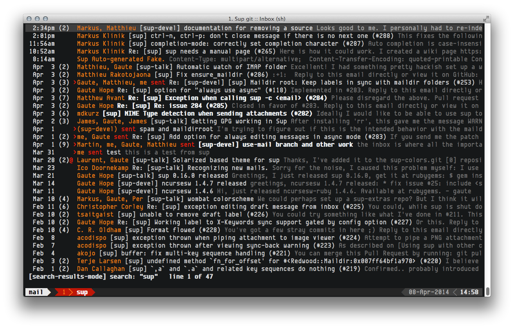
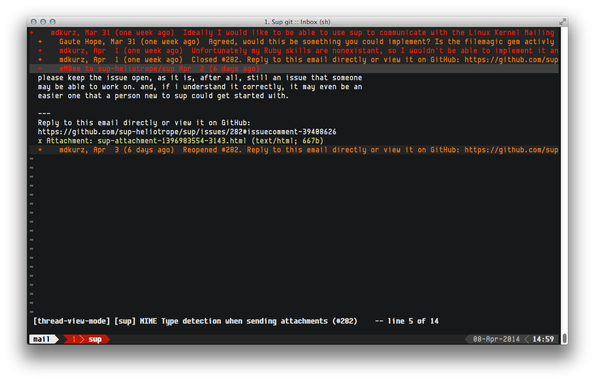

red tide
========
A [sup](https://github.com/sup-heliotrope/sup) colorscheme.  By default, sup uses the same color for the "from" and "subject" fields in the index view.  This scheme has a separate color for the "from" field, but it is not used by default in sup.  The index screenshot below has a slightly different format than default.  See [this](https://github.com/schmeisers/sup/commit/dad02a906173b586ffe0d2c44239a6646f6198ce) commit for the changes.

